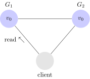
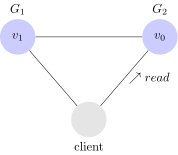
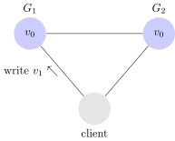
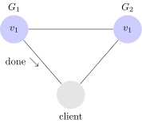

---
layout:     post
title:      CAP定理
subtitle:    CAP定理的图解证明
date:       2019-11-21
author:     BY
header-img: img/post-bg-ios9-web.jpg
catalog: true
tags:
    - cap
    - 分布式
    - java
    - 开源框架
---
# CAP定理的图解证明

该[CAP定理](http://en.wikipedia.org/wiki/CAP_theorem)是在分布式系统中的一个基本定理，指出任何分布式系统最多可以有两个以下三个属性。

- 一致性
- 可用性
- 分区容错性

本指南将总结 [Gilbert和Lynch的规范以及](http://lpd.epfl.ch/sgilbert/pubs/BrewersConjecture-SigAct.pdf) 带有图片[的CAP定理的证明](http://lpd.epfl.ch/sgilbert/pubs/BrewersConjecture-SigAct.pdf)！

## 什么是CAP定理？

CAP定理指出分布式系统不能同时具有一致性，可用性和分区容错性。听起来很简单，但保持一致性意味着什么？可用性是什么？分区容忍又是什么？它们在分布式系统中究竟意味什么？

在本节中，我们将介绍一个简单的分布式系统，并解释该系统可用性，一致性和分区容错性的含义。有关系统和三个属性的正式描述，请参阅 [Gilbert和Lynch的论文](http://lpd.epfl.ch/sgilbert/pubs/BrewersConjecture-SigAct.pdf)。

## 分布式系统

让我们考虑一个非常简单的分布式系统。我们的系统由两台服务器G1和G2。这两个服务器都跟踪同一个变量v，它的初始值是v0。G1和G2可以相互通信，也可以与外部客户端通信。这是我们系统的结构。

客户端可以从任何服务器请求进行写入和读取。当服务器收到请求时，它会执行它想要的任何计算，然后响应客户端。例如，这是写的流程。

这就是读取的流程。

现在我们已经建立了系统，让我们回顾一下系统的一致性，可用性和分区容忍性意味着什么。

## 一致性

以下是Gilbert和Lynch描述一致性的方法。

> 在写操作完成后开始的任何读操作都必须返回该值，或者是后续写操作的结果.

在一致的系统中，一旦客户端将值写入任何服务器并获得响应，它就希望从它读取的任何服务器返回该值（或更新的值）。

以下是**不一致**系统的示例。

我们的客户写v1到G1并且G1响应确认成功，但是从G2读取v，它得到旧的数据：v0。

另一方面，这是一个**一致性** 系统的例子。

在这个系统中，在向客户发送确认之前,G1将其值复制到G2。因此，当客户端从G2读取时，它读取到v的最新值：v1。

## 可用性

以下是Gilbert和Lynch描述可用性的方法。

> 系统中非故障节点收到的每个请求都必须得到响应.

在可用系统中，如果我们的客户端向服务器发送请求并且服务器未崩溃，则服务器必须最终响应客户端。不允许服务器忽略客户端的请求。

## 分区容错

以下是Gilbert和Lynch描述分区容错的方法。

> 允许网络丢失从一个节点发送到另一个节点的任意多条消息

这意味着G1和G2之间发送给对方的任何消息都可以丢失。如果丢失了所有消息，那么我们的系统将如下所示。

尽管有网络分区，我们的系统必须能够正常运行才能说我们的系统是分区容错的。

## 证明

现在我们已经熟悉了一致性，可用性和分区容错的概念，我们可以证明系统不能同时拥有这三者。

假设确实存在一致性，可用性和分区容错的系统。我们要做的第一件事是分区我们的系统。看起来像这样。

接下来，我们的客户端请求将v1写入G1。由于我们的系统可用，G1必须回应。但是，由于网络是分区的，因此G1无法将其数据复制到G2。Gilbert 和Lynch 称这个执行阶段为α1。

接下来，我们让客户向G2发出读取请求。同样，由于我们的系统可用，G2必须回应。并且由于网络是分区的，G2无法从G1获取更新值。它返回v0。Gilbert 和Lynch这个执行阶段为α2。

系统在客户端将v1写入G1之后,G2返回v0给客户端。这是不一致的。

 我们通过假设存在一个具有一致性，可用性和分区容错的系统，之后我们通过实际演示说明了对于任何这样的系统会存在导致系统不一致的情况。因此，不存在这样的系统。

