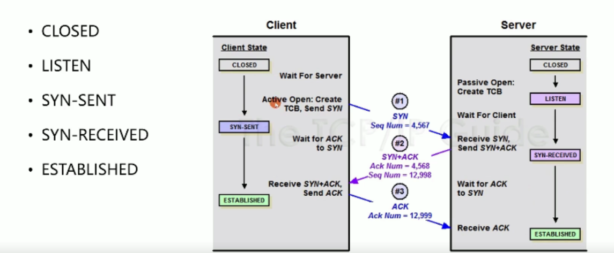
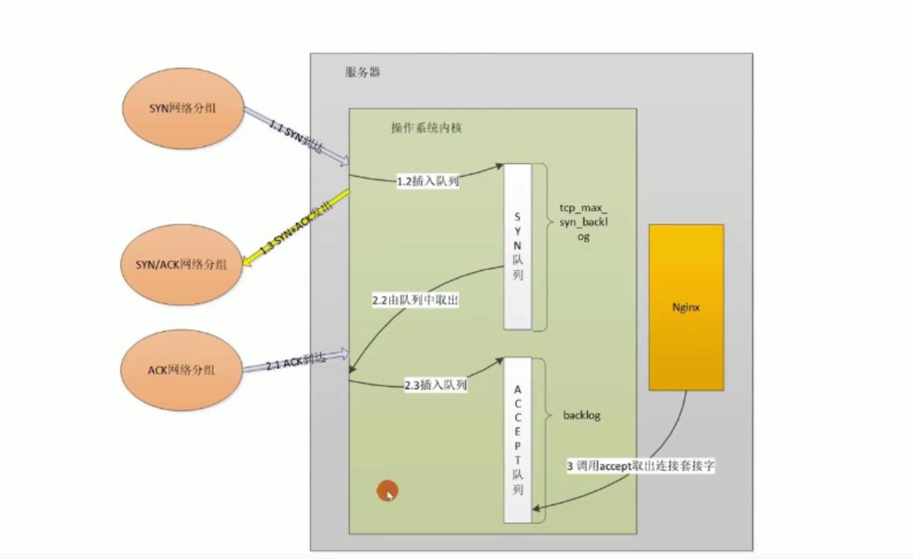
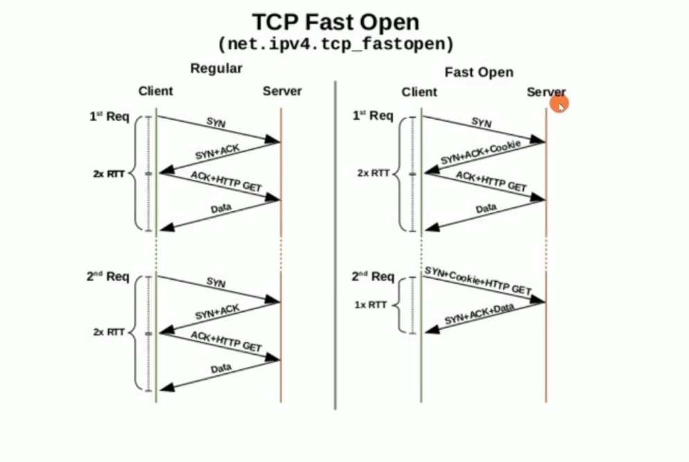
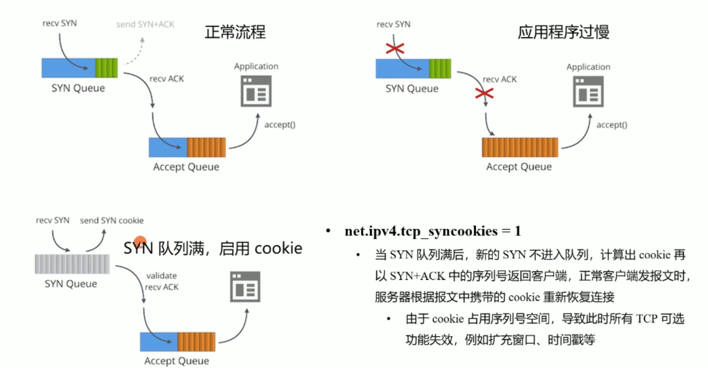

# TCP协议

TCP提供了一种面向连接的、可靠的字节流服务。面向连接意味着两个使用TCP的应用（通常是一个客户和一个服务器）在彼此交换数据之前必须先建立一个TCP连接。但其实，**网络上的传输是没有连接的，包括TCP也是一样的**。而TCP所谓的“连接”，其实只不过是在通讯的双方维护一个“连接状态”，让它看上去好像有连接一样。在一个TCP连接中，仅有两方进行彼此通信。

### 名词

RTT：

MSS：

### tcp首部

你需要注意这么几点：

- TCP的包是没有IP地址的，那是IP层上的事。但是有源端口和目标端口。这两个值加上IP首部中的源端IP地址和目的端IP地址唯一确定一个TCP连接。
- 一个TCP连接需要四个元组来表示是同一个连接（src_ip, src_port, dst_ip, dst_port）准确说是五元组，还有一个是协议。但因为这里只是说TCP协议，所以，这里我只说四元组。
- 注意上图中的四个非常重要的东西：
  - **Sequence Number**是包的序号，**用来解决网络包乱序（reordering）问题。**
  - **Acknowledgement Number**就是ACK——用于确认收到，**用来解决不丢包的问题**。
  - **Window又叫Advertised-Window**，也就是著名的滑动窗口（Sliding Window），**用于解决流控的**。
  - **TCP Flag** ，也就是包的类型，**主要是用于操控TCP的状态机的**。

关于其它的东西，可以参看下面的图示

### TCP状态机

其实，**网络上的传输是没有连接的，包括TCP也是一样的**。而TCP所谓的“连接”，其实只不过是在通讯的双方维护一个“连接状态”，让它看上去好像有连接一样。所以，TCP的状态变换是非常重要的。

下面是：“**TCP协议的状态机**”（[图片来源](http://www.tcpipguide.com/free/t_TCPOperationalOverviewandtheTCPFiniteStateMachineF-2.htm)） 和 “**TCP建链接**”、“**TCP断链接**”、“**传数据**” 的对照图，我把两个图并排放在一起，这样方便在你对照着看。另外，下面这两个图非常非常的重要，你一定要记牢。（吐个槽：看到这样复杂的状态机，就知道这个协议有多复杂，复杂的东西总是有很多坑爹的事情，所以TCP协议其实也挺坑爹的）

 

很多人会问，为什么建链接要3次握手，断链接需要4次挥手？

- **对于建链接的3次握手，**主要是要初始化Sequence Number 的初始值。通信的双方要互相通知对方自己的初始化的Sequence Number（缩写为ISN：Inital Sequence Number）——所以叫SYN，全称Synchronize Sequence Numbers。也就上图中的 x 和 y。这个号要作为以后的数据通信的序号，以保证应用层接收到的数据不会因为网络上的传输的问题而乱序（TCP会用这个序号来拼接数据）。

- **对于4次挥手，**其实你仔细看是2次，因为TCP是全双工的，所以，发送方和接收方都需要Fin和Ack。只不过，有一方是被动的，所以看上去就成了所谓的4次挥手。如果两边同时断连接，那就会就进入到CLOSING状态，然后到达TIME_WAIT状态。下图是双方同时断连接的示意图（你同样可以对照着TCP状态机看）：

两端同时断连接（[图片来源](http://www.tcpipguide.com/free/t_TCPConnectionTermination-4.htm)）

### 连接的建立和终止

#### 建立连接（三次握手）

##### 目的

同步Seq序列号

交换TCP通讯参数（比如MSS，窗口比例因子，选择性确认，指定校验和算法）

##### 三次握手

###### 流程

1. 请求端（通常称为客户）发送一个SYN段指明客户打算连接的服务器的端口，以及初始序号（ISN，在这个例子中为1415531521）。这个SYN段为报文段1。
2. 服务器发回包含服务器的初始序号的SYN报文段（报文段2）作为应答。同时，将确认序号设置为客户的ISN加1以对客户的SYN报文段进行确认。一个SYN将占用一个序号。
3. 客户必须将确认序号设置为服务器的ISN加1以对服务器的SYN报文段进行确认（报文段3）。

这三个报文段完成连接的建立。这个过程也称为三次握手（three-way handshake）。

###### 状态转换

###### 性能优化与安全问题

握手流程示例

超时时间与缓冲队列

应用层connect超时时间调整

操作系统内核限制调整

服务端SYN_REV状态

SYN_RECD状态连接的最大个数

客户端SYN_SEND状态

主动建立连接时，发SYN的重试次数

建立连接时本地端口可用范围

ACCEPT队列设置

###### FAST OPEN降低时延

###### 如何应对SYN攻击

启用TCP_SYNCOOKIES

TCP_DEFER_ACCEPT

http://www.52im.net/topic-tcpipvol1.html?mobile=no

