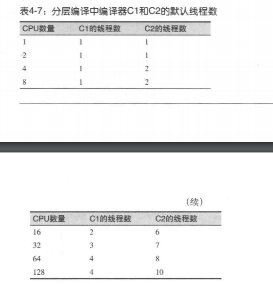

性能分析

操作系统工具和分析

cpu使用率

通常cpu使用率可以分为两类：用户态时间和系统态时间。用户态是CPU执行应用代码所占时间的百分比，系统态时间是CPU执行内核代码所占时间的百分比。

vmstat 1 （每隔一秒显示一行）

磁盘使用率

iostat -xm 5

网络使用率

### java监控工具

jcmd 打印java进程设计的基本类，线程和vm信息

jcmd help可以列出所有的命令

jconsole

线程的使用，类的使用和GC活动

jhat

读取内存堆转储

jmap

堆转储和其他jvm内存使用的信息。

jinfo查看jvm系统属性，可以动态设置一些系统属性

jstack

转储java进程的栈信息

jstat

提供GC和类装载活动的信息

### 编译器优化

编译器版本


#### 编译器中级调优

##### 调优代码缓存

jvm编译代码时，代码缓存中保留编译之后的汇编语言指令集。代码缓存的大小固定，所以一旦填满，jvm就不能编译更多代码了。

##### 编译阈值

编译是基于两种jvm计数器，方法调用计数器和方法中的循环回变计数器。回边实际上可看作是循环完成执行的次数。

jvm执行某个方法是。检查该方法的两种计数器总数，然后判定该方法是否适合编译。如果适合进入编译队列，这种叫标准编译。

但如果循环真的很长，例如包含所有程序逻辑而永远不退出，这种情况，jvm不等方法被调用完就会编译循环，所以循环每完成一轮，回边计数器增加并检测。如果达到阈值，那这个循环就可可以被编译（不是整个方法）。这种编译称为栈上替换（OSR）。

##### 检测编译过程

-XX:+PrintCompilation

开启PrintCompilation，每次编译一个方法（或循环），jvm都会打印一行被编译的内容信息。

用jstat检测编译

jstat -compiler pid

jstat -printcompilation pid 1000 每1s输出一次信息


#### 高级编译器调优

##### 编译线程



##### 内联

编译器做的最重要的优化是方法内联。

举个例子：

```java
int a = 1;
int b = 2;
int result = add(a, b);
...
public int add(int x, int y) { return x + y; }
int result = a + b; //内联替换
```

上面的add方法可以简单的被替换成为内联表达式。

使用内联可以为程序带来很多好处，比如

- 不会引起额外的性能损失
- 减少指针的间接引用
- 不需要对内联方法进行虚方法查找

内联取决于方法的大小。缺省情况下，含有 35 个字节码或更少的方法可以进行内联操作。对于被频繁调用的方法，临界值可以达到 325 个字节。我们可以通过设置 -XX:MaxInlineSize=# 选项来修改最大的临界值，通过设置‑XX:FreqInlineSize=#选项来修改频繁调用的方法的临界值。但是在没有正确的分析的情况下，我们不应该修改这些配置。因为盲目地修改可能会对程序的性能带来不可预料的影响。

##### 逃逸分析

##### 逆优化

#### 分层编译级别


https://www.infoq.cn/article/i9fQSLZPYzZeEuQ7aFRb

[https://www.cnblogs.com/flydean/p/jvm-jit-in-detail.html#inlining%E5%86%85%E8%81%94](https://www.cnblogs.com/flydean/p/jvm-jit-in-detail.html#inlining内联)

https://www.infoq.cn/article/Java-Application-Hostile-to-JIT-Compilation

https://www.itzhai.com/jvm/what-exactly-does-the-java-compiler-do.html

[https://blog.lovezhy.cc/2019/11/28/HotSpot%E5%8E%9F%E7%90%86%E6%8C%87%E5%8D%97-%E5%86%85%E8%81%94/](https://blog.lovezhy.cc/2019/11/28/HotSpot原理指南-内联/)